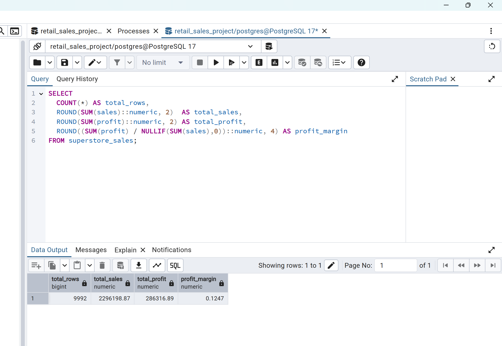
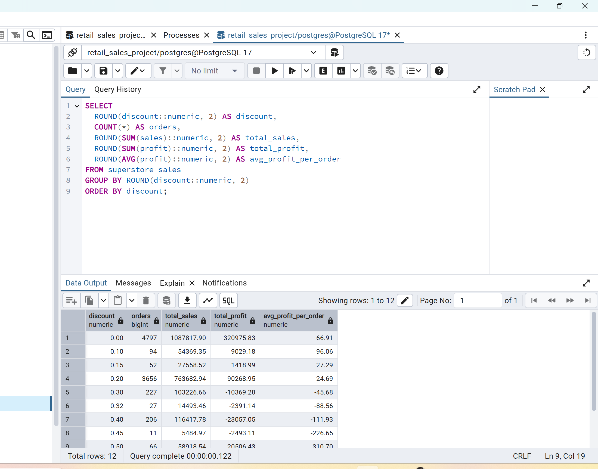
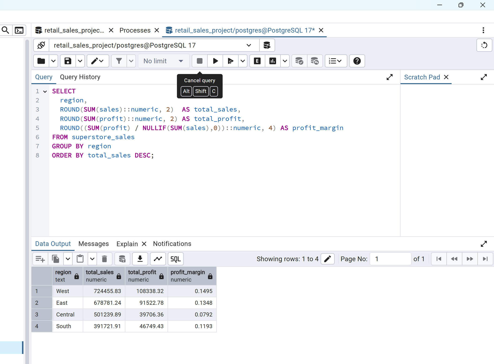
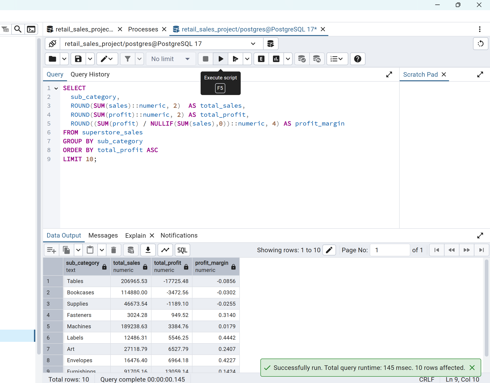

# PostgreSQL Superstore Sales Analysis

## Project Summary

This project analyzes a retail sales dataset using PostgreSQL to uncover insights about business performance, profitability, and discount strategies. The dataset contains nearly 10,000 transactions across multiple regions, product categories, and discount levels.

Using SQL queries, the analysis evaluates key performance indicators (KPIs), regional sales trends, discount impact on profitability, and product-level performance.

---

## Tools Used

* PostgreSQL
* pgAdmin 4
* SQL

---

## Dataset

The project uses the **Superstore retail dataset**, which contains transaction-level data including:

* Order information
* Product categories and sub-categories
* Sales revenue
* Profit values
* Discount levels
* Customer and regional data

Total records analyzed: **9,992 orders**

Dataset location:

```
data/superstore_utf8.csv
```

---

## Project Structure

```
postgresql-superstore-sales-analysis
│
├── data
│   └── superstore_utf8.csv
│
├── sql
│   └── superstore_analysis.sql
│
├── screenshots
│   ├── kpi_summary.png
│   ├── discount_impact_analysis.png
│   ├── regional_sales_performance.png
│   └── subcategory_profitability_analysis.png
│
└── README.md
```

---

## Example SQL Queries

### KPI Summary

```
SELECT
    COUNT(*) AS total_rows,
    ROUND(SUM(sales)::numeric, 2) AS total_sales,
    ROUND(SUM(profit)::numeric, 2) AS total_profit,
    ROUND((SUM(profit) / NULLIF(SUM(sales),0))::numeric, 4) AS profit_margin
FROM superstore_sales;
```

This query calculates overall business metrics including total revenue, profit, and profit margin.

---

### Discount Impact Analysis

```
SELECT
    ROUND(discount::numeric, 2) AS discount,
    COUNT(*) AS orders,
    ROUND(SUM(sales)::numeric, 2) AS total_sales,
    ROUND(SUM(profit)::numeric, 2) AS total_profit,
    ROUND(AVG(profit)::numeric, 2) AS avg_profit_per_order
FROM superstore_sales
GROUP BY ROUND(discount::numeric, 2)
ORDER BY discount;
```

This query evaluates how different discount levels affect profitability.

---

### Regional Sales Performance

```
SELECT
    region,
    ROUND(SUM(sales)::numeric, 2) AS total_sales,
    ROUND(SUM(profit)::numeric, 2) AS total_profit,
    ROUND((SUM(profit) / NULLIF(SUM(sales),0))::numeric, 4) AS profit_margin
FROM superstore_sales
GROUP BY region
ORDER BY total_sales DESC;
```

This query compares sales and profit performance across different geographic regions.

---

### Sub-Category Profitability Analysis

```
SELECT
    sub_category,
    ROUND(SUM(sales)::numeric, 2) AS total_sales,
    ROUND(SUM(profit)::numeric, 2) AS total_profit,
    ROUND((SUM(profit) / NULLIF(SUM(sales),0))::numeric, 4) AS profit_margin
FROM superstore_sales
GROUP BY sub_category
ORDER BY total_profit ASC
LIMIT 10;
```

This query identifies the least profitable product sub-categories.

---

## Query Results

### Business KPI Summary



---

### Discount Impact Analysis



---

### Regional Sales Performance



---

### Sub-Category Profitability Analysis



---

## Key Insights

### Overall Business Performance

* Total Sales: **$2.29M**
* Total Profit: **$286K**
* Profit Margin: **12.47%**

The company is profitable overall but profitability varies significantly across products and discounts.

---

### Regional Performance

* The **West region generates the highest sales and profit**.
* The **Central region has the lowest profit margin**, suggesting potential pricing or operational inefficiencies.

---

### Impact of Discounts

* Higher discounts correlate with **lower profit margins**.
* Discounts above **30–40% often produce negative profit**, indicating that aggressive discounting may harm profitability.

---

### Product Profitability

* Certain sub-categories such as **Tables, Bookcases, and Supplies are unprofitable**.
* These products may require **pricing adjustments, supplier renegotiation, or reduced discounting strategies**.

---

## Conclusion

This project demonstrates how SQL can be used to analyze business data and generate actionable insights. By evaluating sales trends, discount strategies, and product profitability, organizations can make more informed decisions to improve revenue and operational efficiency.

The analysis highlights the importance of monitoring discount strategies and product-level profitability to maintain healthy margins in retail operations.

SELECT region,
       SUM(sales) AS total_sales
FROM superstore
GROUP BY region
ORDER BY total_sales DESC;
